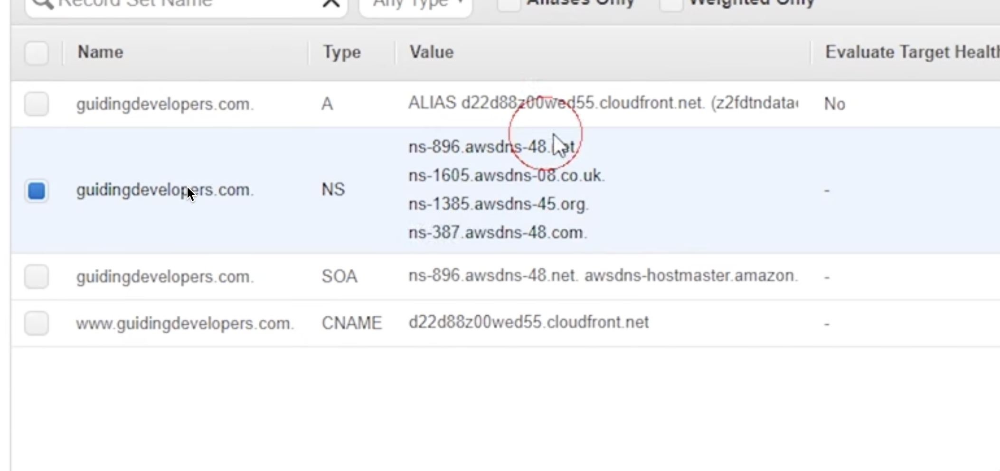
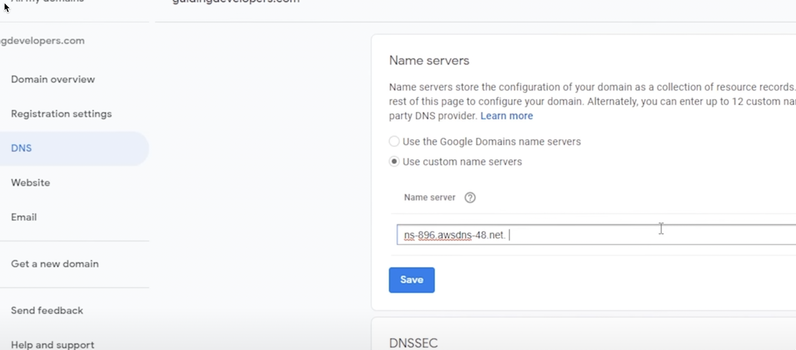
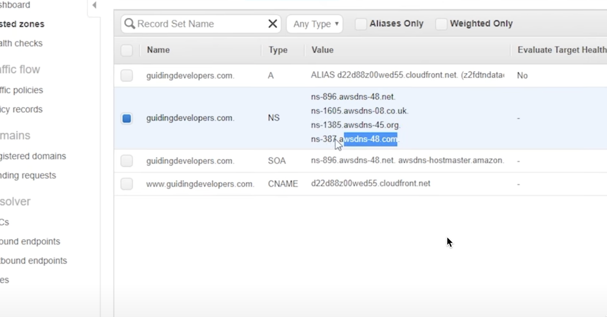
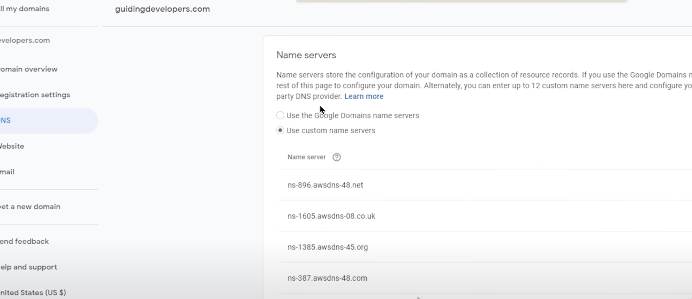
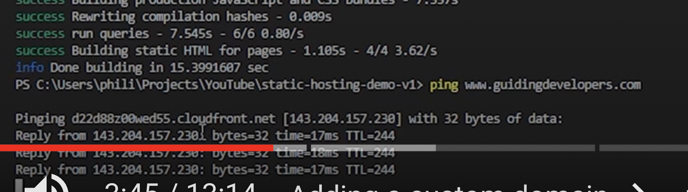
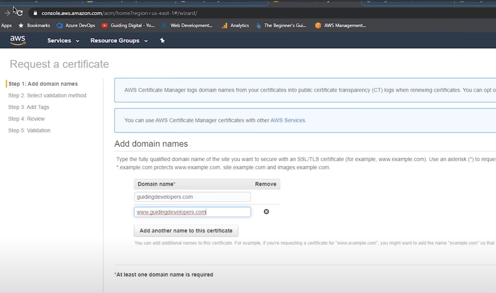
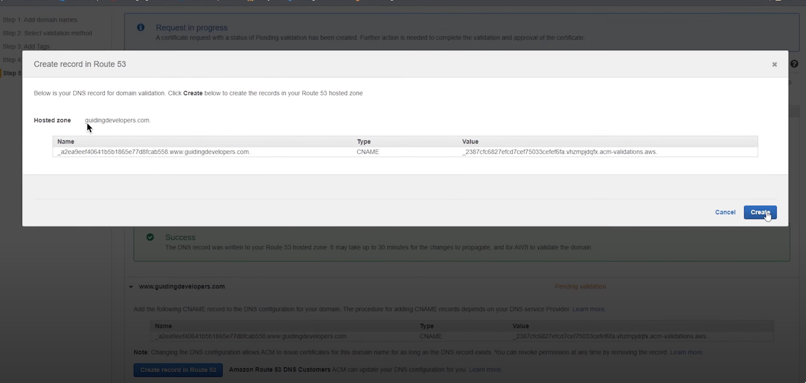
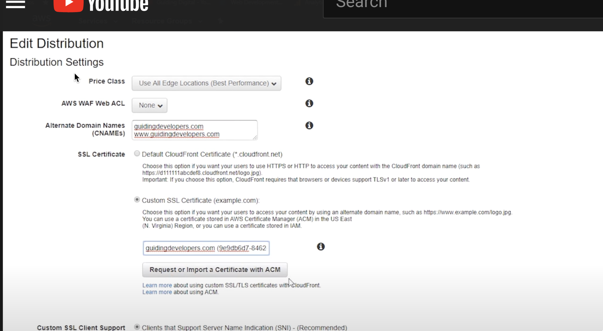
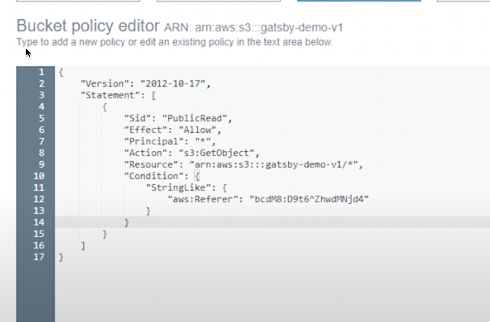
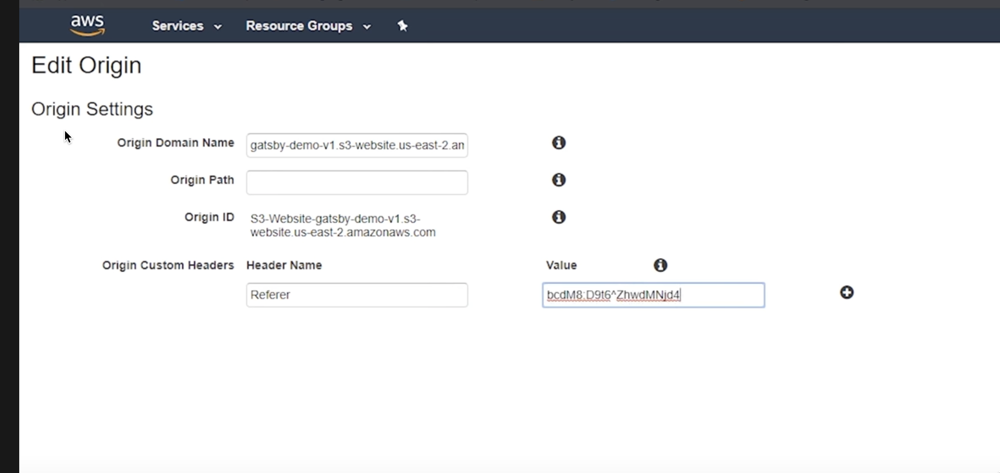

- ADD all 4 domains 

- TEST it by ping it

- REQUEST certificate
need both domain

auto create the record in route53

in cloudfront, add the CNAMES and select the SSL

- CHANGE s3 acl so people need to go through cloudfront to access it
change bucket policy to add a random string

in cloudfront change teh headers to include that random string as referer

